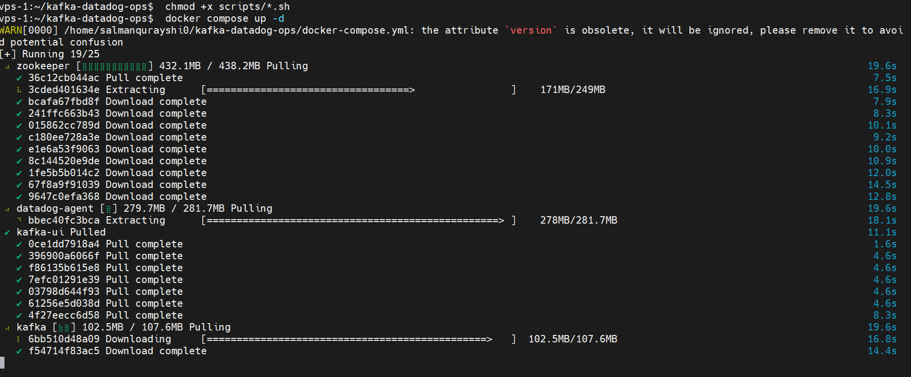
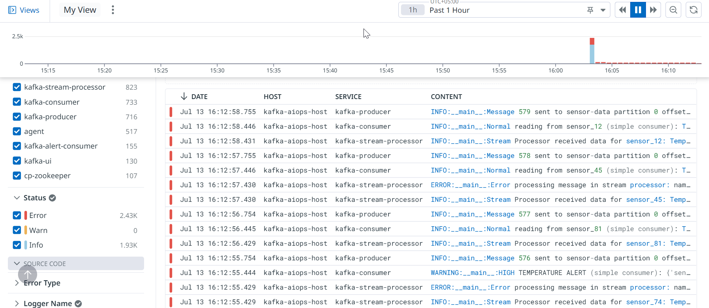
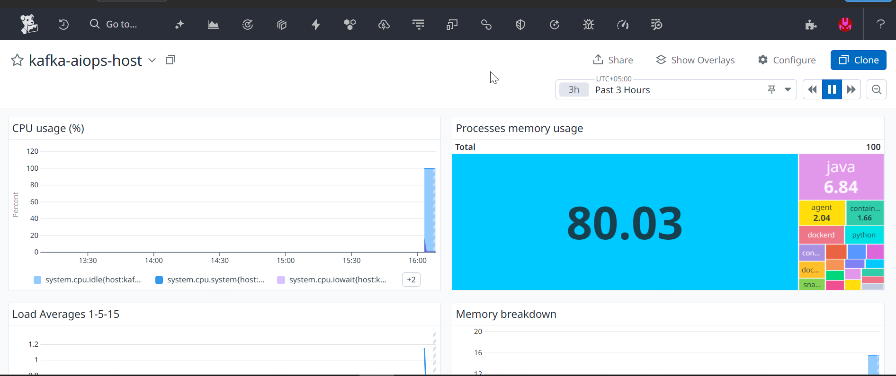
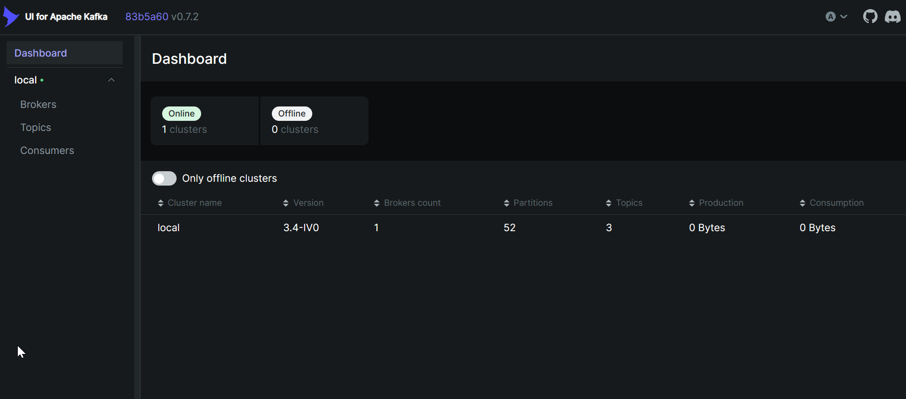

# Kafka Datadog Observability Project

Hello! Welcome to my Kafka Datadog Observability Project. This repository showcases my hands-on experience in deploying a comprehensive Kafka ecosystem using Docker Compose and integrating it with Datadog for robust monitoring and logging.

This project was a journey of learning and problem-solving, and I'm excited to share how I built a fully observable Kafka environment.

---

## 📦 Project Overview

In this project, I set up a multi-service Kafka cluster, including a Kafka Broker, Zookeeper, Kafka UI, and custom Python applications (producer, consumer, stream processor, and alert consumer). The core objective was to establish end-to-end observability by integrating all these components with Datadog, ensuring I could collect critical metrics and logs for operational insights.

I focused on:

- **Containerized Deployment**: Leveraging Docker Compose for easy setup and management of all services.
- **Kafka JMX Monitoring**: Enabling Java Management Extensions (JMX) on Kafka to expose deep operational metrics.
- **Datadog Agent Integration**: Deploying the Datadog Agent to collect host, container, JMX, and log data.
- **Log Management**: Centralizing logs from all Kafka components in Datadog for streamlined troubleshooting.


---

## 📁 Project Structure

```
.
|-- consumer
|   |-- Dockerfile
|   `-- consumer.py
|-- data
|-- datadog-agent-config
|   |-- conf.d
|   |   |-- docker.d
|   |   |   |-- conf.yaml
|   |   |   `-- logs.yaml
|   |   |-- kafka.d
|   |   |   `-- conf.yaml
|   |   `-- zookeeper.d
|   |       `-- conf.yaml
|   `-- logs
|-- docker-compose.yml
|-- logs
|-- producer
|   |-- Dockerfile
|   `-- producer.py
|-- scripts
|   |-- generate_load.sh
|   |-- kafka_monitor.py
|   |-- log_monitor.sh
|   `-- performance_monitor.sh
`-- stream-processor
    |-- Dockerfile
    |-- alert_consumer.py
    `-- stream_processor.py
```


### Folder Breakdown:
- `./datadog-agent-config/`: This directory holds the custom configuration files for the Datadog Agent.
  - `conf.d/`: Contains the integration-specific .yaml files (like `kafka.d/conf.yaml` and `zookeeper.d/conf.yaml`) that tell the Datadog Agent which metrics to collect from my services.
  - `logs/`: Configured as a volume mount for the Datadog Agent's internal logs.
- `./kafka-apps/`: This is where I developed my custom Python applications that interact with the Kafka cluster.
  - `producer.py`: Sends messages to Kafka topics.
  - `consumer.py`: Consumes messages from Kafka topics.
  - `stream_processor.py`: Processes Kafka messages in a stream.
  - `alert_consumer.py`: A consumer designed to trigger alerts based on specific message content.
- `./docker-compose.yml`: The heart of my deployment, defining all the services, networks, and configurations for my Kafka ecosystem and Datadog Agent.


---


### Prerequisites  
Before I started, I made sure I had these installed on my VPS (Virtual Private Server):

- Docker: The containerization platform.
- Docker Compose: For defining and running multi-container Docker applications.
- Datadog API Key: Obtained from my Datadog account, essential for the agent to send data.

---

## Deployment Steps  
Here's the step-by-step process I followed:

### Cloning the Repository:  
First, I cloned this repository to my VPS:

```bash
git clone https://github.com/Salman-Qurayshi/kafka-datadog-ops.git
cd kafka-datadog-ops
```

---

### Setting Up My Datadog API Key:  
I exported my Datadog API key as an environment variable. This is crucial for the Datadog Agent to authenticate with my Datadog account.

```bash
export DD_API_KEY="<YOUR_DATADOG_API_KEY>"
```

> (Remember to replace <YOUR_DATADOG_API_KEY> with your actual key.)

---

### Configuring JMX for Kafka and Zookeeper (Initial docker-compose.yml Setup):  
I configured my `docker-compose.yml` to enable JMX (Java Management Extensions) on both Kafka and Zookeeper. This involved adding specific environment variables to their service definitions to expose JMX ports (9101 for Kafka, 9998 for Zookeeper). This was essential for Datadog's JMXFetch to collect metrics.

---

### Initial Deployment:  
I brought up the services using Docker Compose:

```bash
docker compose up -d
```

Initially, I faced some challenges with Datadog not collecting JMX metrics.

---

### Fixing the Datadog Agent conf.d Volume Mount:  
One of the first issues I encountered was that the Datadog Agent wasn't picking up my custom Kafka and Zookeeper configurations. I discovered that the conf.d volume mount in my `docker-compose.yml` was pointing to the wrong internal path within the agent container.

I corrected the `datadog-agent` service definition in `docker-compose.yml` from:

```yaml
- /opt/datadog-agent/conf.d:/conf.d:ro
```

to the correct path:

```yaml
- ./datadog-agent-config/conf.d:/etc/datadog-agent/conf.d:ro
```

This ensured the agent could find my `kafka.d/conf.yaml` and `zookeeper.d/conf.yaml` files.

---

### Switching to the JMX-Enabled Datadog Agent Image:  
After fixing the volume mount, I still saw an error in the Datadog Agent status indicating that Java was not found. This was a critical realization: the standard Datadog Agent image doesn't include a Java Runtime Environment (JRE), which JMXFetch requires.

I updated the `datadog-agent` service image in `docker-compose.yml` from:

```yaml
image: gcr.io/datadoghq/agent:7
```

to the JMX-enabled variant:

```yaml
image: gcr.io/datadoghq/agent:7-jmx
```

This change finally allowed JMXFetch to run and collect Kafka metrics.

---

### Applying Changes and Redeploying:  
After each `docker-compose.yml` modification, I followed this Git workflow to update my VPS:

**Local Machine:**
```bash
git add .
git commit -m "Your descriptive commit message"
git push origin main
```

**VPS:**
```bash
cd ~/kafka-datadog-ops
git pull origin main
docker compose down # To stop and remove old containers
docker compose up -d # To start new containers with updated config
```

---

### Verifying Datadog Agent Status:  
After each deployment, I checked the Datadog Agent's status to ensure integrations were running correctly:

```bash
docker exec -it datadog-agent agent status
```

This command was invaluable for debugging and confirming that Kafka JMX metrics were being initialized and collected.

---

## Monitoring & Observability Highlights  
With everything deployed, I can now observe my Kafka ecosystem in Datadog:

- **Kafka Metrics:** I'm collecting over 350 JMX metrics from my Kafka broker, giving me deep insights into its performance, message rates, and internal state.
- **Container Metrics:** Datadog automatically collects essential CPU, memory, and network metrics for all my Docker containers, providing foundational infrastructure visibility.
- **Unified Logs:** All logs from my Kafka broker, Zookeeper, Kafka UI, and custom applications are centralized in Datadog. This allows me to search, filter, and analyze logs alongside metrics for faster troubleshooting.

---

## Screenshots  
I'll add screenshots here to visually demonstrate the project's setup and the data flowing into Datadog.


- **Docker Compose Services Running**
    


- **Datadog Agent Status (Kafka Check Initialized)**
    


- **Datadog Logs Explorer**
    


- **Datadog Metrics Explorer (Kafka Metrics)**
    

- **Kafka UI Dashboard**
    

---

## Future Enhancements  
While this project successfully establishes core observability, here are some areas I plan to explore for further enhancement:

- **Datadog Dashboards:** Building comprehensive, custom dashboards in Datadog to visualize key Kafka and application performance indicators.
- **Datadog Monitors & Alerts:** Setting up proactive alerts for critical Kafka and application health metrics (e.g., high latency, low message throughput, consumer lag).
- **Datadog APM for Custom Apps:** Integrating Datadog's APM libraries directly into my Python producer, consumer, and stream processor applications to get distributed traces and service maps.
- **Kafka KRaft Migration:** Updating the Kafka services to run in KRaft mode, eliminating the Zookeeper dependency entirely, and adapting monitoring accordingly.
- **Advanced Log Parsing:** Implementing custom log processing rules in Datadog to extract more structured data from Kafka logs.

---

This project has been a valuable learning experience in building robust, observable distributed systems. Feel free to explore the code, replicate the setup, and provide any feedback!
